# Gerenciamento de Memória
## Gerenciador de memória: 
Responsável por alocar e liberar espaços na memória para os processos em execução. Também responsável por gerenciar chaveamento entre os níveis de memória: principal e secundaria. Principal e cache.

## Tipos de gerenciamento:

    Com paginação: Processos são movidos entre a memória pricipal e o disco.
    
    Artifício usado para resolver o problema de falta de memória. Não utilizado se existe memória pricipal suficiente.

    Sem paginação.

Monoprogramação: Sem paginação.Apenas um processo na memória.

Multiprogramação: Vários processos na memória.

## Sistemas sem abstração de memória:

    A realocação estática simplesmente considera o primeiro endereço válido de uma área de memória atribuída a um programa como uma constante, que é somada a cada endereço de programa durante o processo de carregamento.
    Simples mas torna o carregamento lento.

    Realocação dinâmica: Feita em tempo de execução. Registrador base e registrador limite.
    Registrador base: Valor de menor endereço físico.
    Registrador Limite: Faixa de endereços lógicos.
    Cada endereço lógico deve ser menor que o conteúdo armazenado no registrador limite.
    Esse endereço, se válido, é então calculado dinamicamente adicionando‐se o valor contido no registrador base. O endereço calculado é então enviado à memória.

## Particionamento de memória

### Partições Fixas: 
    Tamanho e número de partições fixos (estáticos).
    Tendem a desperdiçar memória.
    Simples.
    Filas múltiplas: Problema: filas não balanceadas.
    Fila única: Melhor utilização da memória, pois procura o melhor processo para a partição considerada. Problema: Processos menores são prejudicados.
    Problemas com fragmentação:
        Interna: Desperdício de memória dentro da área alocada para um processo.
        Externa: Desperdício fora da área alocada para um processo.

### Partições Variáveis:
    Tamanho e número de partições variam.
    Otimiza utilização da memória, mas complica a alocação e liberação da memória.
    Partições alocadas dinamicamente.
    SO mantém na memória uma lista com os espaços livres.
    Menor fragmentação interna e grande fragmentação externa. Solução: Comptactação.

    Minimizar espaço de memória utilizado.
        Compactação: Necessária para recuperar os espaços perdidos por fragmentação: Muito custosa para UCP.
    Técnicas de alocação dinâmica de memória:
        Bitmaps;
        Listas Encadeadas;
    Bitmaps:
        Memória é dividida em unidades de alocação em kbytes;
        Cada unidade corresponde a um bit do bitmap: 0 -> Livre. 1 -> Ocupado.
    Tamanho do bitmap depende do tamanho da unidade e do tamanho da memória.
    Unidades de alocação pequenas -> bitmap grande;
    Unidades de alocação grandes -> perda de espaço;
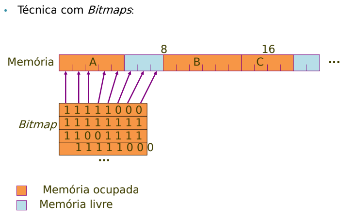

    Técnica com Listas Encadeadas:
    Uma lista para os espaços vazios e outra para os espaços cheios, ou uma lista para ambos!
        Espaço -> segmento

## Algoritmos de Alocação
### First Fit
    1° segmento é usado.
    Rápido mas pode desperdiçar memória por fragmentação.
### Next Fit
    1° segmento é usado.
    Próxima alocação inicia busca do ponto que parou anteriormente.
    Desempenho inferior.
### Best Fit
    Procura na lista toda e aloca o espaço que mais convém.
    Menor fragmentação;
    Mais lento;
### Worst Fit
    Aloca o maior espaço disponível
    Gera 'fragmentos' grandes, mais fáceis de serem utilizados por outros processos.
### Quick Fit
    Mantém listas separadas para alguns dos tamanhos de segmentos de memória disponíveis em geral mais solicitados.
###
    Cada algoritmo pode manter listas separadas para processos e espaços livres.
        Aumenta desempenho
        Aumenta complexidade quando espaço de memória é liberado - gerenciamneto das listas. Fragmentação.
### O que fazer quando não existe espaço o suficiente para todos os processos ativos?
    Swapping: Chaveamento de processos inteiros entre a memória principal e o disco.
    Overlays -> Memória Virtual.
        Programas são divididos em pedaços menores
        Pedaços são chaveados entre a memória principal e o disco.
### Swapping
    Chaveamento de processos inteiros entra a memória principal e o disco.
    Transferência do processo da memória principal para a memória secundária: Swap out.
    Trasferência do processo da memória secundária para a memória principal: Swap in.
    Pode ser utilizado tnato com partições fixas quanto com partições variáveis.
    Programas maiores que a memória eram divididos em pedaços chamados overlays.
        Programador define áreas de overlay. Expansão da memória principal mas com custo muito alto.
## Memória Virtual
    Sistema operacional é responsável por dividir o programa em overlays.
    SO realiza o chaveamento desses pedaços entre a memória e o disco.
    Espaço de endereçamento virtual: Endereços Virtuais que o processo pode gerar.
    Espaço de endereçamento Físico: Endereços físicos/reais aceitos pela memória principal.
    Um processo em Memória Virtual faz referência a endereços virtuais e não a endereço reais de memória principal.
    No momento da execução de uma instrução, o endereço virtual é traduzido para um endereço real, pois a CPU manipula apenas endereços reais da memória principal -> Mapeamento.
### MMU(Memory managment unit)
    Realiza o mapeamento dos endereços lógicos para os endereços físicos.
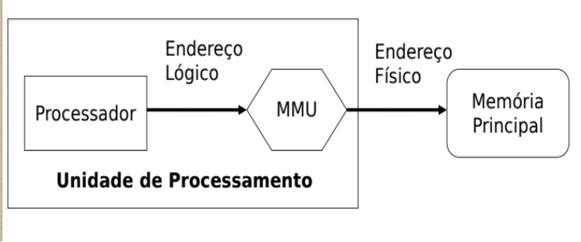

### Técnicas de MV:
    Paginação:
        Blocos de tamanho fixo chamados de páginas.
        SO mantém uma lista de todas as páginas.
        Endereços Virtuais formam o espaço de endereçamento virtual.
        Espaço de endereçamento virtual dividido em páginas virtuais.
        Mapeamento entre endereços reais e virtuais realizado pela MMU.
    Segmentação:
        Blocos de tamanho arbitrário chamados segmentos.
    
### Paginação:
    MP e MS são organizadas em páginas do mesmo tamanho.
    Página é a unidade básica para transferência de informação.
    Tabela de páginas: responsável por armazenar informações sobre as páginas virtuais:
        Argumento de entrada: número da página virtual.
        Argumento de saída (resultado): número da página real(ou moldura de página - page frame).
    Problemas:
        Fragmentação interna.
        Definição do tamanho das páginas:
            Geralmente a MMU que define, não o SO.
            Páginas maiores: Leitura mais eficiente, tabela menor, maior fragmentação interna.
            Páginas Menores: leitura menos eficiente, tabela maior, menor fragmentação interna.
            512 bytes a 64 KB.
    Mapa de bits ou Lista encadeada com páginas livres.

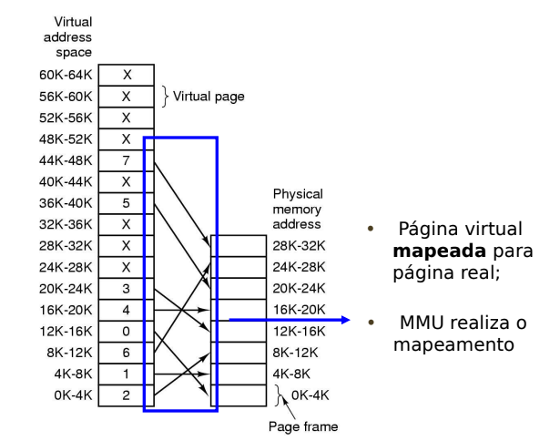

    A tabela de páginas pode ser armazenada de três maneiras diferentes:
        Em um conjunto de registradores, se a memória for pequena:
            Rápido
            Precisa carregar toda a tabela nos registradores a cada chaveamento de contexto
        Na própria MP -> MMu gerencia utilizando dois registradores
            Registrador base da tabela de páginas: Indica o endereço físico de   memória onde a tabela está alocada.
            Registrador Limite da tabela de páginas: Indica o número de entradas da tabela.
            Dois acessos à memória.
        Em uma memória cache da MMU chamada Memória Associativa.
            Também conhecida como TLB(Translation Lookaside Buffer - buffer).
            Hardware especial para mapear endereços virtuais para endereços reais sem ter que passar pela tabela de páginas na MP.
            Melhora desempenho.
### Alocação de Páginas
    Alocação Fixa ou estática: cada processo tem um número máximo de páginas reais, definido quando o processo é criado.
        O limite pode ser igual para todos os processos.
        Simples.
        Número pequeno de páginas reais pode causar muita paginação. Número muito grande de páginas reais causa desperdício de MP.
    Alocação variável ou dinâmica: número máximo de páginas reais alocadas ao processo varia durante a execução.
        Processos com elevada taxa de paginação podem ter seu limite de páginas reais ampliado. Processos com baixa taxa de paginação podem ter seu limite de páginas reais diminuido.
        Monitoramento constante.
    Política de busca de páginas: determina quando uma página deve ser carregada para a MP
        Paginação simples: todas as páginas virtuais do processo são carregadas.
        Paginação por demanda: Apenas as páginas referenciadas são carregadas na MP. Bit de Controle. Pagina inválida.
        Paginação antecipada.
            Carrega para a memória principal, além da referenciada, outras páginas que podem ou não ser necessárias para o processo.
        Paginação Inválida: MMU gera uma interrupção de proteção e aciona o SO.
            Se a página está fora do espaço do endereçamento do processo, o processo é abortado.
            Se a página ainda não foi carregada na MP, ocorre uma falta de página(page fault).
        Page fault:
            Processo é suspenso e seu descritor é inserido em uma fila especial - fila dos processos esperando uma PV.
            Uma página real livre deve ser alocada.
            A PV acessada deve ser localizada no disco.
            Operação de leitura de disco, indicando o endereço da PV no disco e o endereço da página real alocada.
            Após a leitura do disco:
                Tablea de páginas é corrigida para indicar que a PV agora está válida.
                    Pager: carrega páginas específicas de um processo do disco para a MP.
                O descritor do processo é retirado da fila especial e colocado na fila do processador.
### Troca de páginas

    Se todas as páginas estiverem ocupadas, uma página deve ser retirada. Página Vítima.
### Algoritmos de Trocas de Páginas Baseados somente no Histórico:
        Não dispõem de recursos que permitam o uso de informações sobre operações anteriores sobre cada uma das páginas, apenas um histórico linear de acessos.
        São métodos mais simples, empregados em sistemas mais básicos: um processo de decisão simples geralmente é realizado rapidamente.
    
### First-in First-out Page Replacement(FIFO)
    SO mantém uma lista das páginas correntes na memória, sendo a mais antiga a inicial e a mais nova a final.
    Simples mas pode ser ineficiente, pois uma página que está em uso constante pode ser retirada.

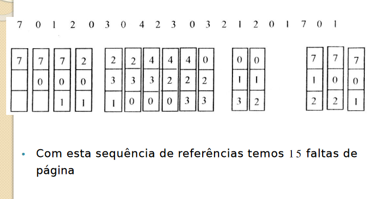

### Algoritmo Ótimo (Optimal Replacement - OPT)
    Retira da memória a página que tem menos chance de ser referenciada.
        Praticamente impossível de se saber.
        Impraticável.
        Usado em simulações para comparação com outros algoritmos.

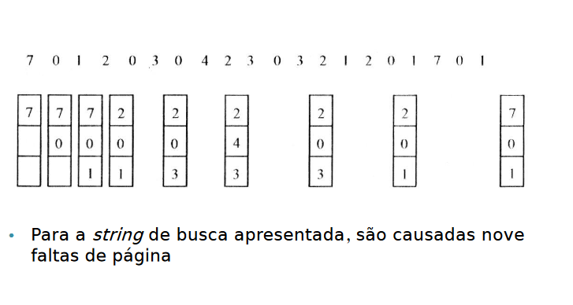

### Least Recently Used Page Replacement(LRU)
    Pode ser implementado tanto por hardware quanto por software:
        Hardware: MMU deve suportar a implementação LRU.
            Contador em hardware (64 bits) - conta instruções executadas;
            Após cada referência à memória o valor do contador é armazenado na entrada da tabela de páginas referente à página acessada.
            Quando ocorre page fault o SO examina todos os contadore e escolhe a página que tem o menor valor.

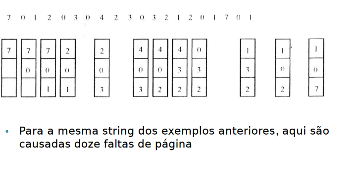     

    Bastante utilizado e considerado muito bom. Problema está na forma de implementação. O sistema necessita manter uma lista das páginas da memória, ordenada por último uso. Duas formas de implementação:
        Contador: a cada entrada na tabela de páginas é associado um registrador de tempo de uso. Sempre que uma referência a pagina é feita, o valor do tempo é carregado no registrador. A página substituída deve ser aquela com o menor valor de tempo.
        Pilha: nessa abordagem é mantida uma estrutura de pilha dos números das páginas. Quando a pagina é referenciada, ela é removida da pilha e colocada no topo. Dessa forma, o fundo da pilha sempre contém a página usada menos recentemente.
    
### Algoritmos de Troca de Páginas - Empregando Informações Adicionais:
    Com o propósito de aumentarem a eficiência do gerenciamento de memória através da minimização do número de trocas de páginas armazenadas na memória principal, alguns algoritmos podem se valer de duas informações adicionais no seu processo de decisão:
            Página referenciada: uma página acessada recentemente é considerada referenciada e, teoricamente, tem uma maior chance de ser utilizada novamente do que uma página que não é referenciada a mais tempo, portanto, tende a ser “poupada” na escolha de uma página para troca. A definição de até quando uma página é considerada referenciada é crítica para o desempenho do algoritmo.
            Página modificada: simplesmente identifica se alguma informação contida na página sofreu uma modificação. Em caso positivo,sua escolha para paginação necessitaria de um swap out, com uma operação de escrita na memória não volátil, tornando o processo mais demorado.
### Not Recently Used Page Replacement (NRU) ou Não Usada Recentemente(NUR)
    Troca as páginas não utilizadas recentemente.
    2 bits associados a cada página -> R (referência) e M (modificação)
        • Classe 0 (R = 0 e M = 0) -> não referenciada, não modificada.
        • Classe 1 (R = 0 e M = 1) -> não referenciada, modificada.
        • Classe 2 (R = 1 e M = 0) -> referenciada, não modificada.
        • Classe 3 (R = 1 e M = 1) -> referenciada, modificada.
    R e M são atualizados a cada referência à memória.
    Priodicamente o bit R é limpo para diferenciar as páginas que não foram referenciadas recentemente. A cada tick do relógio ou interrupção de relógio.
    Classe 3 -> Classe 1.
    Fácil de entender, eficiente para implementar e fornece bom desempenho.
### Algoritmo da Segunda Chance.
    FIFO + bit R.
    Página mais velha é candidata em potencial.
    se bit R == 0, página é retirada, senão, R=0 e se dá uma nova chance à página, colocando-a no final da lista.

### Algoritmo do Relógio
    Lista circular com ponteiro apontado para a página mais antiga.
    Se repete até encontrar R=0.
    Se R=0
        Troca de página
        Desloca o ponteiro.
    Se R=1
        R=0
        Desloca o ponteiro
        Continua a busca

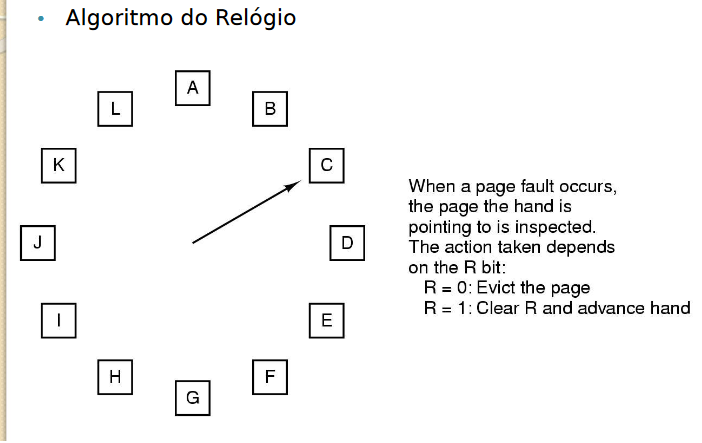

### LRU
    Troca a página menos referenciada/modificada recentemente.
    Alto custo. Necessita armazenar a lista da páginas utilizadas mais recentemente na memória. A lista deve ser atualizada à cada referência da memória.
    Software:
        NFU(Not frequently used) ou LFU(least frequently used).
        Aging(Envelhecimento).
    NFU ou LFU
        Para cada página existe um contador iniciado com zero e incrementado a cada referência à página.
            Página com menor valor do contador é candidata à troca.
            Esse algoritmo não se esquece de nada
        Problema: Pode retirar páginas que estão sendo referenciadas com frequência.
    Aging
        Modificação do NFU. Além de saber quantas vezes a página foi referenciada, também controla quando ela foi referenciada.

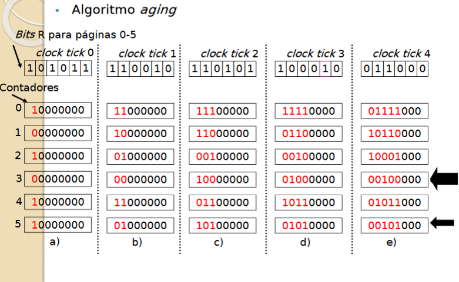

### Algoritmo Working Set (WS)
    Paginação por demanda -> Páginas são carregadas na memória somente quando necessárias.
    Pré-paginação -> WS
        Carregar um conjunto de páginas que um processo está efetivamente utilizando em um determinado tempo t antes de ele ser posto em execução.
    Objetivo: Reduzir a falta de páginas.
        Um processo só é executado quando todas as páginas necessárias no tempo t estão carregadas na memória.
        SO gerencia quais páginas estão no WS
    Resumo: WS pode ser visto como um conjunto de páginas que o processo referenciou durante os t últimos segundos de tempo.
    Utiliza o bit R e o tempo de relógio(tempo virtual) da última vez que a página foi referenciada.

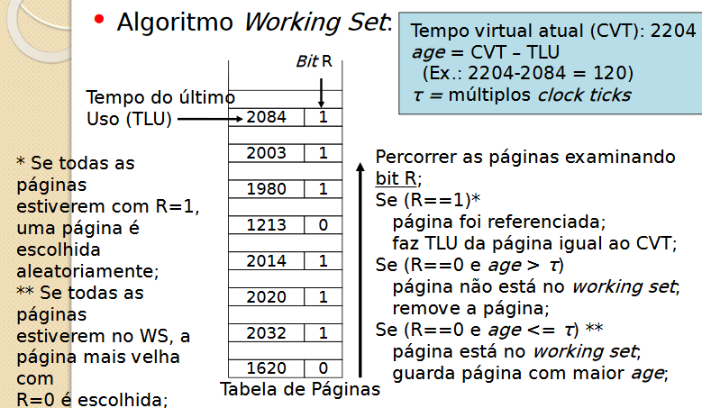    

### Algoritmo WSClock:
    Clock + Working set
    Lista circular de molduras de páginas formando um anel a cada página carregada na memória.
    Utiliza bit R e o tempo da última vez que a página foi referenciada.
    Bit M utilizado para agendar escrita em disco.

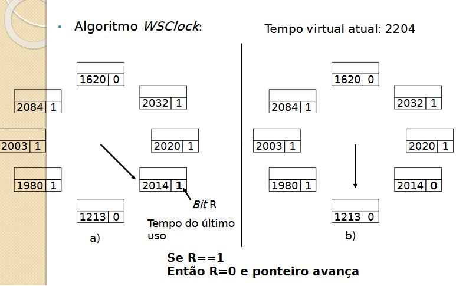
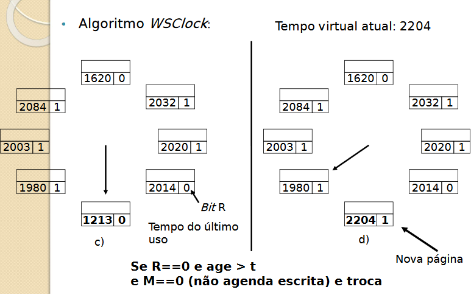
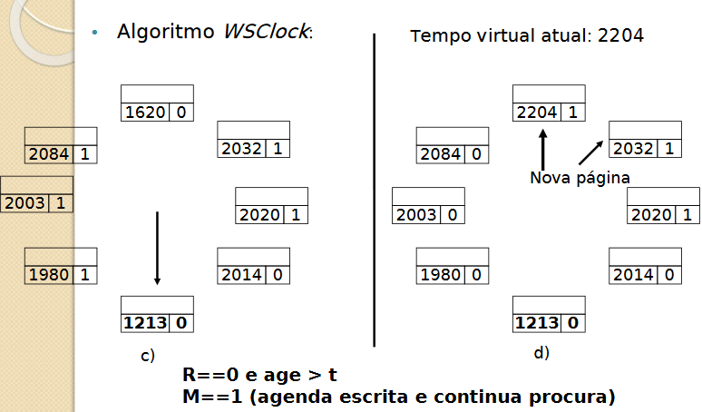
### Política de Substituição local
    Páginas dos próprios processos são utilizados na troca
        Dificuldade: Definir quantas páginas cada processo pode utilizar.
    Permite somente política de substituição local de páginas
    Algoritmos de substituição local:
        •Working Set
        •WSClock
### Política de Substituição Global
    Páginas de todos os processos são utilizadas na troca
        Problema: Processos com menor prioridade podem ter um número muito reduzido de páginas, e com isso, acontecem muitas page faults.
    Permite tanto a política local quanto a global.
    Algoritmos de substituição local/global:
        • Ótimo
        • NRU
        • FIFO
        • Segunda Chance
        • LRU
        • Relógio

### Implementação da paginação
    Memória Secundária:
        A área de troca (swap area) é gerenciada como uma lista de espaços disponíveis.
        O endereço da área de troca de cada processo é mantido na tabela de processos.
            Cálculo de endereço: MMU
        Possibilidade A: Assim que o processo é criado, ele é copiado todo para sua área de troca no disco, sendo carregado para a memória quando necessário.
            Área de troca diferente para dados, pilha e programa, pois área de dados pode crescer e a área de pilha crescerá certamente.
        Possibilidade B: Nada é alocado antecipadamente, espaço é alocado em disco quando a página for enviada para lá. Assim, processo na memória RAM não fica "amarrado" a uma área específica.
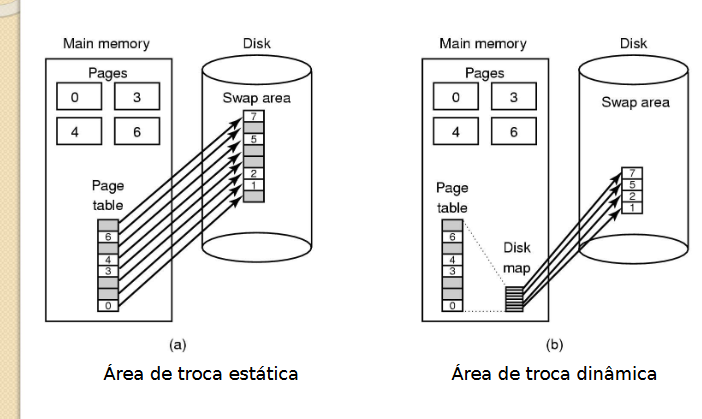

### Segmentação
    Tabelas de segmentos com n linhas, cada qual apontando para um segmento de memória.
    Vários espaços de endereçamento.
    Endereço real -> base + deslocamento
    Alocação de seguimentos segue os algoritmos já estudados:
        •FIRST-FIT;
        •BEST-FIT;
        •NEXT-FIT;
        •WORST-FIT;
        •QUICK-FIT;
    Facilita proteção de dados, compartilhamento de procedimentos e dados entre processos.
    MMU é utilizada para mapeamento entre endereços lógicos e físicos.
        Tabela de segmentos informa qual o endereço da memória física do segmento e seu tamanho.
    Problemas:
        Embora haja espaço na MP, não á espaço contínuo.
            Realocação: um ou mais segmentos são realocados para abrir espaço contínuo.
            Compactação: todos são compactados.
            Bloqueio: Fila de espera.
            Troca: Substituição de segmentos
        Sem fragmentação interna mas com fragmentação externa.

    
    Espaço lógico é formado por segmentos
        Cada segmento é dividido em páginas lógicas
        Cada segmento possui uma tabela de páginas -> endereço da página lógica em endereço de página física.
        No endereçamento a tabela de segmentos indica onde sua respectiva tabela de páginas está.
        
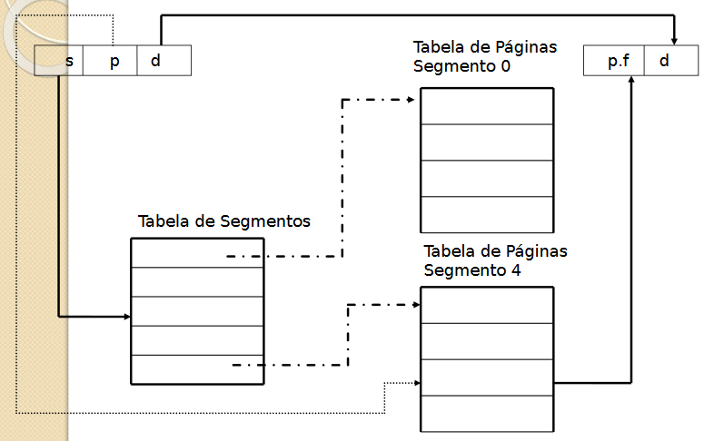

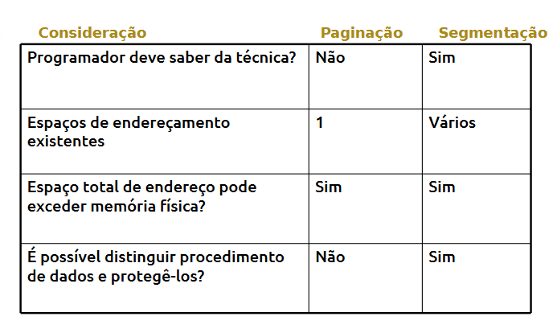
