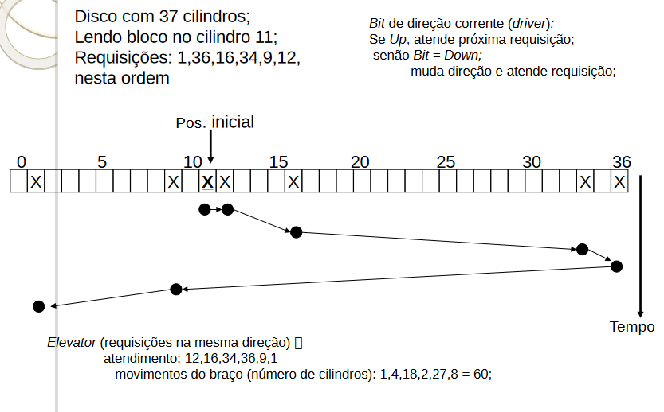
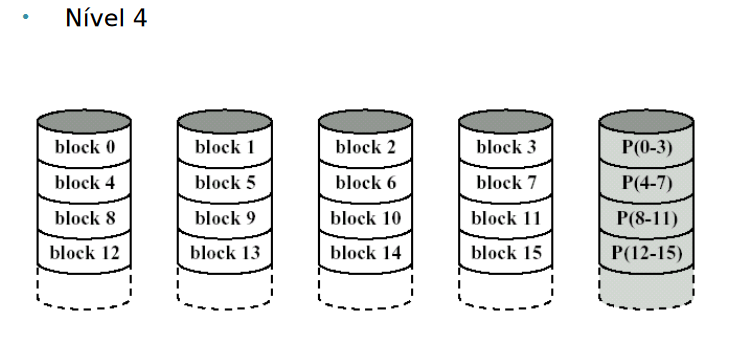

# Gerenciamento de dispositivos de entrada e saída.
## Dispositivos de Entrada e Saída
    Enviar sinais para os dispositivos.
    Atender interrupções.
    Gerenciar comandos aceitos e funcionalidade.
    Tratar possíveis erros.
    Prover interface entre os dispositivos e o sistema.

### Princípios de Hardware
Podem ser divididos em duas categorias:

    Dispositivos baseados em bloco:
        a informação é armazenada em blocos de tamanho fixo, cada um com um endereço próprio. Todas as unidade de transferência são em unidades de um ou mais blocos inteiros(consecutivos).
            Tamanho varia entre 512 e 65536 bytes
            Permitem leitura e escrita independentemente de outros dispositivos
            Permitem operações de posicionamento no meio de armazenamento de dados
            Ex: discos rígidos, memórias flash, mídias ópticas.
    Dispositivos baseados em caracter: Envia ou aceita uma sequência de caracteres, sem se importar com a estrutura de blocos; informação não é endereçável e não possuem operações de posicionamento.
        Ex:Impressoras, placas de rede, mouses, placas de som.
    A classificação não é perfeita pois alguns dispositivos não se encaixam em nenhuma das duas categorias.
    A classificação auxilia na obtenção de independência ao dispositivo
        Parte dependente está a cargo dos drivers, que são os softwares que controlam o acionamento dos dispositivos.
### Controladores de dispositivo
    Dispositivos de E/S possuem basicamente dois componentes.
        Mecânico -> o dispositivo propriamente dito.
        Eletrônico -> controladores ou adaptadores(placas).
    Um controlador pode lidar com múltiplos dispositivos idênticos. Ex: USB
    O dispositivo e a controladora se comunicam por meio de uma interface.
    O controlador e o dispositivo hardware operam em um nível muito baixo, enquanto o S.O. trabalha com dados em um nível mais alto.
### Mapeamento de E/S na memória
    Cada controladora possui um conjunto de registradores de controle, que são utilizados na comunicação com a UCP.
    Através destes registradores, o S.O. pode ordenar ao dispositivo realizar certas tarefas, como:
        • enviar ou receber dados
        • checar o estado do dispositivo
        • ligar e desligar
    Além dos registradores, alguns dispositivos possuem um buffer de dados. Ex: Placa de vídeo.
    O S.O gerencia, utilizando os drivers, os dispositivos de E/S, através de operações de leitura e/ou escrita nos buffers e registradores.
        • Comunicação em baixo nível – instruções em Assembler.
        • Enviar comandos para os dispositivos.
        • Saber o estado dos dispositivos.
    Duas abordagens podem ser empregadas para que esta comunicação seja feita:
        Porta: Cada registrador de controle possui um número de porta de E/S (geralmente, de 8 ou 16 bits);
        Memory-mapped (mapeada na memória): mapear os registradores de controle em espaços de memória;
            • Cada registrador é mapeado em um endereço da memória;
            • Em geral, os endereços estão no topo da memória protegidos em endereços não utilizados por processos;
            • Uso de linguagem de alto nível, já que registradores são apenas variáveis na memória;
            • SOs utilizam essa estratégia para os dispositivos de vídeo.
        O terceiro método é implementado através de uma estratégia híbrida, que emprega dois espaços de endereçamento:
            • Registradores de controle são mapeados para portas de E/S;
            • Buffers de dados de E/S são mapeados para a memória;
            • Exemplo: Pentium - endereços de 640k a 1M para os buffers de dados e as portas de E/S de 0 a 64k - 1;
            

    • Quando a UCP deseja ler uma palavra (da memória ou de uma porta de E/S), ela coloca o endereço que ela está desejando no barramento de endereço e manda um comando READ no barramento de controle;
        • Uma segunda linha de sinal é usada para informar se o espaço requisitado é de E/S ou de memória;
        • No caso (a), espaços de memória e E/S separados, apenas um dos espaços de memória, o do dispositivo correspondente, responderá a requisição;
        • No modelo (b), E/S mapeada na memória, como só há um espaço de memória, cada módulo de memória e cada dispositivo de E/S comparam as linhas de endereço com a faixa de endereços a eles designadas; responde aquele ao qual o endereço esteja contido na faixa;
### Uso de Interrupções 
    Interrupções de E/S (Interrupt-driven I/O)
        Sinais de interrupção são enviados (através dos barramentos) pelos dispositivos ao processador
        Ao receber uma interrupção, o controlador de interrupções decide o que fazer:
            Envia para UCP
            Ignora no momento pois outra interrupção está em andamento ou recebeu simultaneamente uma de maior prioridade. Nesses casos os dispositivos geram outros sinais até serem atendidos.
            Controlador envia para a UCP através do barramento de endereço de um número que serve para identificar qual dispositivo de E/S precisa ser atendido.
    Controlador de Interrupções: Presente na placa-mãe. Possui vários manipuladores de interrupção. Diferentes tipos de interrupções IRQs (Interrupt ReQuest)
    Manipuladores de interrupção: Gerenciam interrupções realizadas pelos dispositivos de E/S
    Bloqueiam driver até dispositivo terminar a tarefa.
### Maneiras de realizar E/S
    E/S Programada
        Sistemas embarcados/embutidos
    Orientada à interrupção
    Uso de DMA
    Programada
        Forma mais simples, todo trabalho é realizado pela UCP
            SO verifica o estado do dispositivo e, se disponível, envia um caracter por vez para o registrador de dados do dispositivo de E/S
            Após copiado o primeiro caracter, verifica se está pronto para o segundo, geralmente verificando o valor em um registrador de estado.
            Caso ainda esteja processando, SO permanece verificando o valor. Espera ocupada ou pooling.
        Desvantagem: UCP é ocupada até que a E/S seja completada.

    Orientada à interrupção
        A UCP comanda a um dispositivo de E/S que realize uma operação, e equanto ela é realizada, ela é escalonada para executar outro processo, até que receba uma interrupção do dispositivo de E/S, avisando que terminou a operação.
            No exemplo da impressão, a impressora não armazena os caracteres, imprime a medida que chegam; No tempo que leva para realizar a operação de impressão, a UCP faz outra tarefa pendente
            Quando a impressora termina a impressão e está pronta para receber outros caracteres, gera uma interrupção;

    E/S com uso da DMA(Direct memory access)
        Usa um controlador de interrupções via hardware, projetado para esta tarefa em particular.
            O DMA executa o mesmo método da E/S programada, fazendo todo o trabalho que seria realizado pela UCP
        DMA é mais lento que a UCP, porém seu uso só não é vantajoso quando a UCP não tem outras tarefas para fazer.
        O controlador de DMA contém vários registradores que podem ser lidos e escritos pela UCP(basicamente podendo ser 'programado')
            • Registrador de endereço de memória;
            • Registrador contador de bytes;
            • Registrador(es) de controle;
                • Porta de E/S em uso;
                • Tipo da transferência (leitura ou escrita);
                • Unidade de transferência (byte ou palavra);
                • Número de bytes a ser transferido.
    Sem DMA: Controladora do dispositivo lê bloco a partir do endereço fornecido pela UCP, dados armazenados no buffer da controladora, controladora checa os dados, gera interrupção e SO lê os dados do buffer e armazena na MP
    Com DMA:Além do endereço a ser lido, a UCP fornece à controladora de DMA duas outras informações: endereço na RAM para onde transferir os dados e o número de bytes a ser transferido. Controladora de DMA envia dados para a controladora do dispositivo. Controladora do dispositivo lê o bloco de dados, armazena em seu buffer, verificando a consistência. Controladora do dispositivo copia os dados para RAM no endereço especificado na DMA. DMA incrementa o endereço de memória e decrementa o contador com o número de bytes transferidos. Repete até o contador da DMA chegar a 0. Gera interrupção. Quando SO inicia o atendimento à interrupção o bloco de dados já está na RAM.

    A DMA pode tratar múltiplas transferências simultaneamente, para isso é necessário:
        Possuir vários conjuntos de registradores (um para cada operação).
        Decidir quais requisições devem ser atendidas a cada momento: implementação de uma política de escalonamento (Round-Robin ou prioridades, por exemplo).
### Princípios de Software de E/S
    A organização do software como uma série de camadas facilita a independência dos dispositivos, que possibilita aos programadores escrever programas capazes de acessar quaisquer dispositivos de E/S sem ter que especificá-los antecipadamente.
    Camadas mais baixas apresentam detalhes de hardware:
        Drivers e manipuladores de interrupção.
    Camadas mais altas apresentam interface para o usuário
        Aplicações de Usuário
        Chamadas de Sistemas.
        Software Independente de E/S ou Subsistema de Kernel de E/S
#### Device Drivers
    São programas que fazem a comunicação entre o SO (que os gerencia pelo kernel) e o hardware, contendo todo o código dependente do dispositivo.
    Sua função é a de controlar o funcionamento dos dispositivos por meio de sequencias de comandos.
    Dispositivos diferentes usam drivers diferentes.
        Classes de dispositivos podem ter o mesmo driver
    São dinamicamente carregados.

#### Software de E/S no nível Usuário
    Bibliotecas de E/S são utilizadas pelos programas dos usuários
        System Calls
#### Software independente de E/S
    Realizar funções comuns a qualquer dispositivo.
    Prover uma interface uniforme para os drivers do dispositivo.
    Fazer o escalonamento de E/S
    Atribuir um nome lógico a partir do qual o dispositivo é identificado
    Prover buffering: ajuste entre a velocidade e a quantidade de dados transferido
    Cache de dados
    Reportar erros e proteger os dispositivos contra acessos indevidos
    Gerenciar alocação, uso e liberação dos dispositivos
    Transferência de dados:
        • Síncrona (bloqueante): requer bloqueio até que os dados
        estejam prontos para transferência;
        • Assíncrona (não-bloqueante): transferências acionadas por
        interrupções; mais comuns;
    Tipos de dispositivos:
        • Compartilháveis: podem ser utilizados por vários usuários ao mesmo tempo; Exemplo: disco rígido;
        • Dedicados: podem ser utilizados por apenas um usuário de cada vez; Exemplo: impressora, unidade de fita;

### Dispositivos de E/S
#### Discos
    Cada superfície é dividida em trilhas
    Cada trilha é dividida em setores ou blocos(512 a 32K bytes)
    Um conjunto de trilhas formam um cilindro
    Cabeças de leitura e gravação
    Tamanho do disco:
        n° cabelas x n° cilindros x n° setores x tamanho_setor

    Discos magnéticos:
        Velocidade de acesso: Tempo de deslocamento do cabeçote até o cilindro dorrespondente à trilha até o cilindro corresponde à trilha a ser acessada.
        Transferências: tempo para transferência dos dados.
        Capacidade
        Preço.
    Técnica para reduzir o tempo de acesso: Entrelaçamento (interleaving):
        Setores são numerados com um espaço entre eles.
        Entre o setor K e o setor K+1 existem n(fator de entrelaçamento) setores.
            N depende da velocidade do processador, do barramento, da controladora e da velocidade de rotação do disco.

    Drivers de disco:
        Fatores que influenciam tempo para leitura/escrita no disco:
            • Velocidade de acesso (seek): tempo para o movimento do braço até o cilindro
            • Delay de rotação (latência): tempo para posicionar o setor na cabeça do disco
            • Tempo da transferência dos dados
        Tseek + Tlatência + Ttransferência
        • Algoritmos de escalonamento no disco:
        • FCFS (FIFO): First-Come First-Served
        • SSF: Shortest Seek First
        • Elevator (também conhecido como SCAN)
           Variação: Circular Scan (C-SCAN)
        • Escolha do algoritmo depende do número e do tipo de pedidos
        • Driver mantém uma lista encadeada com as requisições para cada cilindro

    FCFS: Atende as requisições na ordem original

    SSF: Atende a requisição que tem o bloco mais próximo do atual

    Elevator(scan): Atende as requisições em ordem crescente/decrescente. Quando chega ao final/inicio do disco, volta à posição inicial e inverte a ordem.

#### Discos RAID
    RAID(Redundant Array of Independent Disks) -> organização de duas ou mais unidades de memória, para obter maior segurança e/ou desempenho.
    RAID combina diversos discos rígidos em uma estrutura lógica.
        Aumenta confiabilidade, capacidade e desempenho dos discos.
        Redundância dos dados.
        Armazenamento simultâneo em vários discos permite que os dados fiquem protegidos contra falha dos discos.
        Performance de acesso, já que a leitura da informação é simultânea nos vários dispositivos.
    Pode ser implementado por:
        Hardware(controladora):
            • Instalação de uma placa RAID no servidor, o subsistema RAID é implementado totalmente em hardware;
            • Libera o processador para se dedicar exclusivamente a outras tarefas;
            • A segurança dos dados aumenta no caso de problemas devido à checagem da informação na placa RAID antes da gravação;
        Software(SO):
            • Menor desempenho no acesso ao disco;
            • Oferece um menor custo e flexibilidade;
            • Sobrecarrega o processador com leitura/escrita nos discos;
        Para o S.O., só existe um único disco (visão lógica)
    A forma pela qual os dados são escritos e acessados define os níveis de RAID(até 9 níveis):
        • RAID 0:
            • Também conhecido como Stripping;
            • Arquivos são espalhados entre os discos em stripes;
            • Melhora desempenho das operações de E/S;
            • Sem controle ou correção de erros;
            • Todo o espaço do disco é utilizado para armazenamento;
            • Utilizam mesma controladora (controladora RAID);
            • Aplicações multimídia (alta taxa de transferência);
            

        • RAID 1:
            • Conhecido como espelhamento (mirroring);
            • Operações de escrita no disco primário são replicadas em um disco secundário;
            • Pode ter controladoras diferentes;
            • Desvantagem: espaço físico em dobro (alto custo);
            • Transações on-line (tolerância a falhas);
        • RAID 10 (ou 0+1):
            • Combinação dos RAID 1 e RAID 0;
            

        • RAID 2/3/4:
            • Dados são armazenados em discos diferentes com paridade (permite reconstruir dados perdidos); Stripes;
            • Paridade é mantida em um disco apenas;
            • Diferença básica: como a paridade é calculada (na transferência):
                • Raid 2 - Hamming ECC (error-correcting codes)– nível de bit;
                • Raid 3 - XOR ECC - nível de byte ou bit;
                • Raid 4 – XOR ECC - nível de bloco;

        • RAID 5:
            • Stripes;
            • Paridade XOR ECC distribuída - nível de bloco;
            • Paridade está distribuída nos discos;

        • RAID 6:
            • Stripes;
            • Raid 5 com dois discos de paridade;

