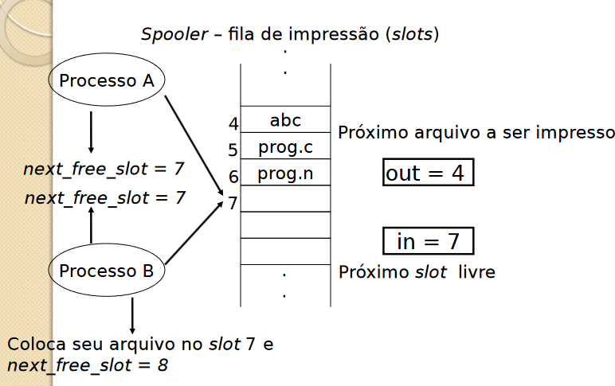
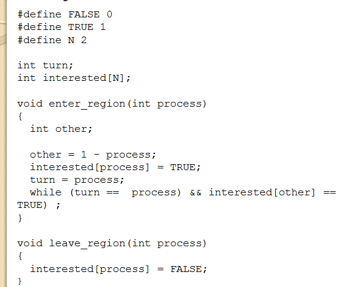
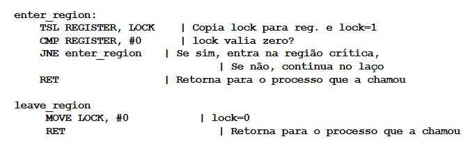

# Comunicação e Sincronismo entre processos.
## Comunicação entre Processos
    Como um processo passa informação para outro processo.
    Como garantir que processos não invadam espaços uns dos outros.
    Dependência entre processos: Sequência adequada de execução.
### Condições de disputa (race condicions)
    Processos acessam recursos compartilhados concorrentemente.
    Memória, arquivos, impressoras, discos, variáveis.
    Ex: Impressão: quando um processo deseja imprimir um arquivo, ele coloca o arquivo em um local especial chamado spooler (tabela). Um outro processo, chamado printer spooler, checa se existe algum arquivo a ser impresso. Se existe, esse arquivo é impresso e retirado do spooler. Imagine dois processos que desejam imprimir um arquivo ao mesmo tempo...

    Proibir que mais de um processo leia ou escreva em recursos compartilhados recorrentemente.
    Recursos compartilhados:Regiões Críticas

### Exclusão mútua: Garantir que um processo não terá acesso à uma região quando outro processo está utilizando essa região.
    Quatro condições para uma boa solução:
        1. Dois processos não podem estar simultaneamente em regiões críticas
        2. Nenhuma restrição deve ser feita com relação à UCP
        3. Processos que não estão em regiões críticas não podem bloquear outros processos que desejam utilizar regiões críticas
        4. Processos não podem esperar para sempre para acessarem regiões críticas

    Implementação:
        Espera Ocupada
        Primitivas Sleep/Wakeup
        Semáforos
        Monitores
        Passagem de Mensagem
    
## Espera Ocupada (Busy waiting)
    Constante checagem por algum valor.
    Algumas soluções para exclusão mútua com espera ocupada:
        • Desabilitar interrupções;
        • Variáveis de Travamento (Lock);
        • Alternância Estrita (Strict Alternation);
        • Solução de Peterson;
        • Instrução TSL.

#### Desabilitar interrupções

    Processo desabilita suas interrupções ao entrar na região crítica e habilita ao sair dela.
    Com as interrupções desabilitadas a UCP não realiza chaveamento entre processos.
        Viola a condição 2 (Nenhuma restrição deve ser feita com relação à UCP);
    Não é uma solução segura pois um processo pode não habilitar novamente suas interrupções e não ser finalizado.
        Viola a condição 4 (Processos não podem esperar para sempre para acessarem regiões críticas)

#### Variáveis Lock
    
    O processo que deseja utilizar uma região crítica atribuí um valor a uma variável chamada lock.
    Se a variável está com valor 0 significa que nenhum processo está na região crítica. Se a variável está com valor 1 significa que existe um processo na região crítica.
    Apresenta o mesmo problema do exemplo do spooler de impressão.
        ◦ Suponha que um processo A leia a variável lock com valor 0
        ◦ Antes que o processo A posso alterar a variável para o valor 1, um processo B é escalonado e altera o valor de lock para 1
        ◦ Quando o processo A for escalonado novamente, ele altera o valor de lock para 1, e ambos os processos estão na região crítica
            • Viola a condição 1 (Dois processos não podem estar simultaneamente em regiões críticas)

#### Alternância Estrita
    Fragmentos de programa controlam o acesso às regiões críticas
    Variável turn, inicialmente 0, estabelece qual processo pode entrar na região crítica

    Problema:
        1. Suponha que o Processo B é mais rápido e sai da região crítica;
        2. Ambos os processos estão fora da região crítica e turn com valor 0;
        3. O processo A termina antes de executar sua região não crítica e retorna ao início do loop; Como o turn está com valor zero, o processo A entra novamente na região crítica, enquanto o processo B ainda está na região não crítica;
        4. Ao sair da região crítica, o processo A atribui o valor 1 à variável turn e entra na sua região não crítica
        5. Novamente ambos os processos estão na região não crítica e a variável turn está com valor 1;
        6. Quando o processo A tenta novamente entrar na região crítica, não consegue, pois turn ainda está com valor 1;
        7. Assim, o processo A fica bloqueado pelo processo B que NÃO está na sua região crítica, violando a condição 3;

#### Solução de Peterson

    Melhoria sobre o modelo de alternância estrita
    Uma variável é utilizada para bloquear a entrada de um processo na região crítica quando um processo está na região.
    Essa variável é compartilhada pelos processos (0 e 1) que concorrem pelo uso da região crítica.
    Se um processo estiver interessado em entrar na região crítica, ele indica esta intenção para os demais processos e ficará esperando.
    Torna-se complexo para uma maior quantidade de processos.

#### Test and Set Lock (TSL)

    A instrução TSL utiliza registradores do hardware.
        TSL RX, LOCK (lê o conteúdo de lock em RX, e armazena um valor diferente de 0) em lock - operação indivisível.
    Lock é compartilhada
        Se lock == 0, região crítica liberada
        Se lock <> 0, região crítica ocupada
    

    Todas as soluções apresentadas utilizam espera ocupada: processos ficam em estado de espera (looping) até que possam utilizar a região crítica:
        • Consome tempo de processamento da UCP
        • Pode levar a situações inesperadas

## Primitivas Sleep/Wakeup

    Para solucionar esse problema de espera, um par de primitivas Sleep e Wakeup é utilizado para fazer o bloqueio e desbloqueio de processos.
    A primitiva Sleep é uma chamada de sistema que bloqueia o processo que a chamou, ou seja, suspende a execução até que outro processo o acorde.
    A primitiva WakeUp é uma chamada de sistema que acorda um determinado processo.
    Ambas possuem dois parâmetros: O processo sendo manipulado e um endereço de memória para realizar a correspondênia entre uma primitiva Sleep com sua correspondente WakeUp.
    Problemas que podem ser solucionados com o uso dessas primitivas:
        ◦ Problema do Produtor/Consumidor (bounded buffer ou buffer limitado): dois processos compartilham um buffer de tamanho fixo. O processo produtor coloca dados no buffer e o processo consumidor retira dados do buffer;
        Problemas:
        • Produtor deseja colocar dados quando o buffer ainda está cheio;
        • Consumidor deseja retirar dados quando o buffer está vazio;
        • Solução: colocar os processos para “dormir”, até que eles possam ser executados;
        •Buffer: uma variável count controla a quantidade de dados presente no buffer.
        •Produtor: Antes de colocar dados no buffer, o processo produtor checa o valor dessa variável. Se a variável está com valor máximo, o processo produtor é colocado para dormir. Caso contrário, o produtor coloca dados no buffer e o incrementa.
        • Consumidor: Antes de retirar dados no buffer, o processo consumidor checa o valor da variável count para saber se ela está com 0 (zero). Se está, o processo vai “dormir”, senão ele retira os dados do buffer e decrementa a variável;

    • Problemas desta solução: Acesso à variável count é irrestrita:
        ◦ O buffer está vazio e o consumidor acabou de checar a variável count com valor 0;
        ◦ O escalonador (por meio de uma interrupção) decide que o processo produtor será executado; Então o processo produtor insere um item no buffer e incrementa a variável count com valor 1; Imaginando que o processo consumidor está dormindo, o processo produtor envia um sinal de wakeup para o consumidor;
        ◦ No entanto, o processo consumidor não está dormindo, e não recebe o sinal de wakeup;
        ◦ Assim que o processo consumidor é executado novamente, a variável count já tem o valor um; Nesse instante, o consumidor é colocado para dormir, pois acha que não existem informações a serem lidas no buffer;
        ◦ Assim que o processo produtor acordar, ele insere outro item no buffer e volta a dormir. Ambos os processos dormem para sempre...
    • Solução: um bit de controle recebe um valor true quando um sinal é enviado para um processo que não está dormindo.
        • No entanto, no caso de existirem vários pares de processos, vários bits devem ser criados, sobrecarregando o sistema.

## Semáforos
    Variável inteira que armazena o número de sinais wakeups enviados
    Um semáforo pode ter valor 0 quando não há sinal armazenado ou valor positivo referente ao número de sinais armazenado
    Duas primitivas de chamada do sistema: down(sleep) e up(wake)
    Down: verifica se o valor do semáforo é maior do que 0; se for, o semáforo é decrementado; se o valor for 0, o processo é colocado para dormir sem completar sua operação de down;
    Todas essas ações são chamadas de ações atômicas;
        • Ações atômicas garantem que quando uma operação no semáforo está sendo executada, nenhum processo pode acessar o semáforo até que a operação seja finalizada ou bloqueada;
    Up: incrementa o valor do semáforo, fazendo com que algum processo que esteja dormindo possa terminar de executar sua operação down;
    Semáforo Mutex: garante a exclusão mútua, não permitindo que os processos acessem uma região crítica ao mesmo tempo
        • Também chamado de semáforo binário

    • Problema produtor/consumidor: resolve o problema de perda de sinais enviados;
    • Solução utiliza três semáforos:
        ◦ Full: conta o número de slots no buffer que estão ocupados; iniciado com 0; resolve sincronização;
        ◦ Empty: conta o número de slots no buffer que estão vazios; iniciado com o número total de slots no buffer; resolve sincronização;
        ◦ Mutex: garante que os processos produtor e consumidor não acessem o buffer ao mesmo tempo; iniciado com 1; permite a exclusão mútua;

    • Problema: erro de programação pode gerar um deadlock;
        ◦ Suponha que o código seja trocado no processo produtor;
    

    ◦ Se o buffer estiver cheio, o produtor será bloqueado com mutex = 0; Assim, a próxima vez que o consumidor tentar acessar o buffer, ele tenta executar um down sobre o mutex, ficando também bloqueado.

## Monitores
    Primitiva (unidade básica de sincronização) de alto nível para sincronizar processos.
        Conjunto de processos, variáveis e estruturas de dados agrupados em um único módulo ou pacote.
    Somente um processo pode estar ativo dentro do monitor em um mesmo instante. Outros processos ficam bloqueados até que possam estar ativos no monitor.

     Execução:
        • Chamada a uma rotina do monitor;
        • As instruções iniciais fazem um teste para detectar se um outro processo está ativo dentro do monitor;
        • Se positivo, o processo novo ficará bloqueado até que o outro processo deixe o monitor;
        • Caso contrário, o processo novo executa as rotinas no monitor;
    Condition Variables (condition): variáveis que indicam uma condição;
    Operações Básicas: WAIT e SIGNAL
        wait (condition) : bloqueia o processo;
        signal (condition) : “acorda” o processo que executou um wait na variável condition e foi bloqueado;
    Variáveis condicionais não são contadores, portanto, não acumulam sinais;
    Se um sinal é enviado sem ninguém (processo) estar esperando, o sinal é perdido;
    Assim, um comando WAIT deve vir antes de um comando SIGNAL.
    Como evitar dois processos ativos no monitor ao mesmo tempo?
        (1) Hoare: colocar o processo mais recente para rodar, suspendendo o outro!!!(sinalizar e esperar)
        (2) Hansen: um processo que executa um SIGNAL deve deixar o monitor imediatamente;
            O comando SIGNAL deve ser o último de um procedimento do monitor;
        A condição (2) é mais simples e mais fácil de se implementar.

    A exclusão mútua automática dos procedimentos do monitor garante que, por exemplo, se o produtor dentro de um procedimento do monitor descobrir queo buffer está cheio, esse produtor será capaz de terminar a operação de WAIT sem se preocupar, pois o consumidor não estará ativo dentro do monitor até que WAIT tenha terminado e o produtor tenha sido marcado como não mais executável;
    Limitações de semáforos e monitores:
        • Ambos são boas soluções somente para CPUs com memória compartilhada. Não são boas soluções para sistema distribuídos;
        • Nenhuma das soluções provê troca de informações entre processo que estão em diferentes máquinas;
        • Monitores dependem de uma linguagem de programação – poucas linguagens suportam
        Monitores;

## Passagem de Mensagem

    Provê troca de mensagens entre processos rodando em máquinas diferentes
    Utiliza-se de duas primitivas de chamadas de sistema: send e receive;
    Podem ser implementadas como procedimentos
        send(destination,&message)
        receive(source,&message)
    O procedimento send envia para um determinado destino uma mensagem, enquanto que o procedimento receive recebe essa mensagem em uma determinada fonte; Se nenhuma mensagem está disponível, o procedimento receive é bloqueado até que uma mensagem chegue.
    Problemas desta solução:
        Mensagens são enviadas para/por máquinas conectadas em rede; assim mensagens podem se perder ao longo da transmissão;
        Mensagem especial chamada acknowledgement: o procedimento receive envia um acknowledgement para o procedimento send. Se esse acknowledgement não chega no procedimento send, esse procedimento retransmite a mensagem já enviada;
    A mensagem é recebida corretamente, mas o acknowledgement se perde.
    Então o receive deve ter uma maneira de saber se uma mensagem recebida é uma retransmissão
        • Cada mensagem enviada pelo send possui uma identificação – sequência de números. Assim, ao receber uma nova mensagem, o receive verifica essa identificação, se ela for semelhante a de alguma mensagem já recebida, o receive descarta a mensagem!
    Problemas:
        • Desempenho: copiar mensagens de um processo para o outro é mais lento do que operações com semáforos e monitores;
        • Autenticação e segurança;

## Outros mecanismos
    • RPC – Remote Procedure Call
        • Rotinas que permitem comunicação de processos em
        diferentes máquinas;
        • Chamadas remotas;
    • MPI – Message-passing Interface;
        • Sistemas paralelos;
    • RMI Java – Remote Method Invocation
        • Permite que um objeto ativo em uma máquina virtual Java possa interagir com objetos de outras máquinas virtuais Java, independentemente da localização dessas máquinas virtuais;
    • Web Services
        • Permite que serviços sejam compartilhados através da Web
    • Pipe:
        • Permite a criação de filas de processos;
        • ps -ef | grep produtor_consumidor;
        • Saída de um processo é a entrada de outro;
        • Existe enquanto o processo existir;
    • Named pipe:
        • Extensão de pipe;
        • Continua existindo mesmo depois que o processo
        terminar;
        • Criado com chamadas de sistemas;
    • Socket:
        • Par endereço IP e porta utilizado para comunicação entre processos em máquinas diferentes;
        • Host X (192.168.1.1:1065) Server Y (192.168.1.2:80);

## Problemas Clássicos de comunicação entre processos

### Problema do Jantar dos Filósofos

        • Cinco filósofos desejam comer espaguete; No entanto, para poder comer, cada filósofo precisa utilizar dois garfo e não apenas um. Portanto, os filósofos precisam
        compartilhar o uso do garfo de forma sincronizada.
        • Uma versão atualizada modifica o espaguete por arroz e os garfos por hashis, eliminando a controvérsia de usar dois garfos para comer o espaguete
        • Os filósofos comem e pensam;
     Problemas que devem ser evitados:
        • Deadlock – todos os filósofos pegam um garfo ao mesmo tempo;
        • Starvation – os filósofos fiquem indefinidamente pegando garfos simultaneamente;

#### Solucao 1

    • Problemas da solução 1:
        • Execução do take_fork(i): Se todos os filósofos pegarem o garfo da esquerda, nenhum pega o da direita: Deadlock
    • Se modificar a solução (mudança 1):
        • Verificar antes se o garfo da direita está disponível. Se não está, devolve o da esquerda e começa novamente: Starvation (Inanição);
        • Tempo fixo ou tempo aleatório (rede Ethernet);
            • Serve para sistemas não-críticos

#### Solucao 2

    • Não apresenta:
        • Deadlocks;
        • Starvation;
    • Permite o máximo de “paralelismo”;

### Exclusão Mútua Problema dos Leitores/Escritores

    O problema dos Leitores e Escritores modela o acesso compartilhado a uma base de dados. Processos leitores e processos escritores competem por um acesso a essa base.
    É possível que vários processos leitores acessem a base ao mesmo tempo, no entanto, quando um processo escritor está escrevendo (modificando) a base de dados, nenhum outro processo pode realizar um acesso, nem mesmo um processo leitor.

### Problema do Barbeiro

    Na barbearia há um barbeiro, uma cadeira de barbeiro e n cadeiras para os clientes esperarem para ser atendidos. Quando não há clientes, o barbeiro senta-se na cadeira do barbeiro e dorme. Quando um cliente chega, ele precisa acordar o barbeiro para ser atendido.
    Se outros clientes chegarem enquanto o barbeiro estiver ocupado cortando o cabelo de algum cliente, eles se sentam se houver cadeiras disponíveis para clientes, senão eles vão embora se todas as cadeiras para clientes estiverem ocupadas.

