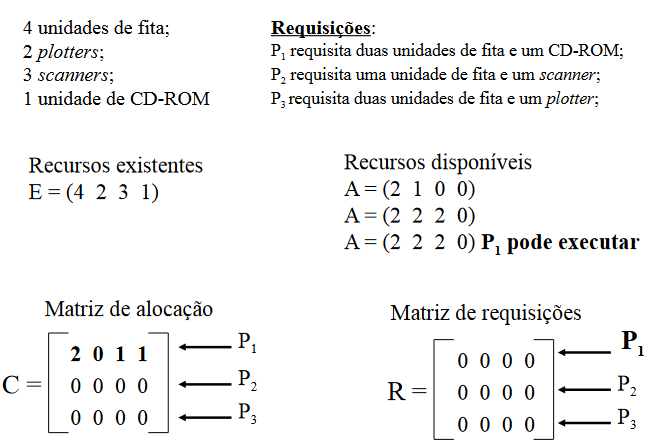
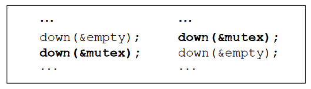

# Deadlocks (Impasses)
    Processos ficam parados, sem possibilidade de poderem continuar seu processamento.

## Recursos
    Objetos acessados, os quais podem ser tanto hardware quanto informação.
        Preemptivos: podem ser  retirados do processo sem prejuízos.
            Memória
            UCP
        Não preemptivos: Não podem ser retirados do processo, pois causam prejuízos.
            Leitores Ópticos(CD,DVD)
            Unidades de fita
    Deadlocks ocorrem com recursos não-preemptivos
    Operações sobre recursos/dispositivos:
        Requisição do recurso.
        Utilização do recurso.
        Liberação do recurso.
    Se o recurso requerido não está disponível, duas situações podem ocorres
        Processo que requisitou o recurso fica bloqueado até que o recurso seja liberado
        Processo que requisitou o recurso falha, e depois de um tempo tenta requisitar novamente o recurso
    Aquisição do recurso
        para alguns tipos de recursos, os processos dos usuários gerenciam o uso dos recursos, através, por exemplo, de semáforos
            EX: Acesso a registros em um sistema de banco de dados
        Se vários processos tentam acessar os mesmo recursos, podem ocorrer situações onde a ordem de solicitação dos recursos pode conduzir a um deadlock ou não.

## Deadlocks

    Definição formal:
        "Um conjunto de processos estará em situação de deadlock se todo processo pertencente ao conjunto estiver esperando por um evento que somente um outro processo desse mesmo conjunto poderá fazer acontecer.”
    Deadlocks
    Quatro condições para que ocorra um deadlock:
        Exclusão mútua: cada recurso pode estar somente em uma de duas situações: ou associado a um único processo ou disponível;
        Posse e espera (hold and wait): processo que, em um determinado instante, retêm recursos concedidos anteriormente, podem requisitar novos recursos;
        Não-preempção: recursos já alocados não podem ser forçosamente retirados do processo que os alocou; somente o processo que alocou os recursos pode liberá-los;
        Espera Circular: um processo pode esperar por recursos alocados a outro processo, que por sua vez espera por recursos alocados a outro processo, e assim por diante, até que o último espera por recursos alocados ao primeiro;
    Todas as condições devem ocorrer para que ocorra um deadlock.
    Geralmente, deadlocks são modelados através de grafos a fim de facilitar sua detecção, prevenção e recuperação
    Processos são simbolizados por círculos, enquanto recursos são representados por quadrados
        Um arco de um recurso para um processo significa que o recurso está alocado para o processo;
        Um arco de um processo para um recurso significa que o processo está bloqueado no momento, esperando que este recurso seja liberado;
    A ocorrência de ciclos indica um deadlock

    Quatro estágios para tratar deadlocks
        Ignorar o problema
        Detectar e recuperar o problema
        Evitar dinamicamente o problema - alocação cuidadosa de recursos
        Prevenir o problema por meio da não satisfação de uma das quatro condições.

### Ignorar o problema
    Algoritmo do AVESTRUZ
    Com qual frequência ocorre o problema
    Alto custo - estabelecimento de condições para uso de recursos
    Empregada por Unix e Windows

### Detectar e Recuperar o problema
    Processos estão com todos os recursos alocados
    Procedimento: Permite que os deadlocks ocorram, para em seguida tentar detectar as causas e solucionar a situação.
    Algoritmos:
        Detecção com um recurso de cada tipo.
        Detecção com vários recursos de cada tipo.
        Recuperação por meio de preempção.
        Recuperação por meio de rollback.
        Recuperação por meio de eliminação de processos.

    Detecção com vários recursos de cada tipo
        Classes diferentes de recursos - vetor de recursos existentes (E):
            Se Classe 1 = unidade de fita e E1=2, então existem duas unidades de fita.
        Vetor de recursos disponíveis (A)
            Se ambas as unidades de fita estiverem alocadas, A1=0
        Duas matrizes
            C: Matriz de alocação corrente
                Cij: Número de instâncias do recurso j entregues ao processo i
            R: Matriz de requisições:
                Rij: Número de instãncias do recurso j que o processo i precisa.

    Nesse algoritmo, o sistema procura periodicamente por deadlocks
    Cuidado:
        Evitar ociosidade da UCP: Quando se tem muitos processos em situação de deadlock, poucos processos estão em execução.

    Recuperação de Deadlocks:
        Por meio de preempção: Possibilidade de retirar temporariamente um recurso de seu atual dono (processo) e entregá-lo a outro processo.
        Por meio de retrocesso(rollback): Recursos alocados a um processo são armazenados em arquivos de verificação. Quando ocorre um deadlock, os processos voltam ao estado no qual estavam antes do deadlock: Solução cara.
        Por meio de eliminação de processos: Processos que estão no ciclo com deadlock são retirados do ciclo.
        Melhor solução para processos que não causam algum efeito negativo ao sistema.
            Compilação - sem problemas
            Atualização de uma base de dados - problemas
        
### Evitar dinamicamente o problema
    Alocação individual de recursos à medida que o processo necessita.
    Soluções também utilizam matrizes.
    Escalonamento cuidadoso: alto custo
        Conhecimento prévio do recursos que serão utilizados
    Algoritmos:
        Banqueiro para um único tipo de recurso
        Banqueiro para vários tipos de recursos
    Definição de Estados Seguros e Inseguros
    Estados seguros: Não provocam deadlocks e há uma maneira de atender a todas as requisições pendentes finalizando normalmente todos os processos.
        A partir de um estado seguro, existe a garantia de que os processos terminarão.
    Estados Inseguros: Podem provocar deadlocks, mas não necessariamente provocam
        A partir de um estado inseguro, não é possível garantir que os processos terminarão corretamente.
    

    Algoritmos do Banqueiro
        Considera cada requisição no momento em que ela ocorre, verificando se essa requisição leva a um estado seguro. Se sim, a requisição é atendida, se não o atendimento é adiado para outro momento.
        Premissas adotadas por um banqueiro (SO) para garantir ou não crédito (recursos) para seus clientes (processos).
        Nem todos os clientes (processos) precisam de toda a linha de crédito (recursos) disponível para eles.
        Desvantagens:
            Pouco utilizado, pois é dificil saber quais recursos serão necessários.
            Escalonamento cuidadoso é caro para o sistema.
            O número de processos é dinâmico e pode variar constantemente, tornando o algoritmo custoso.
        Vantagem:
            Na teoria, o algoritmo do banqueiro é considerado ótimo.

### Atacar uma das quatro condições

### Espera Circular

### Sem envolvimento de Recursos

    Deadlocks podem ocorrer sem o envolvimento de recursos, por exemplo, se semáforos forem implementados erroneamente.
    

    Inanição (Starvation)
        Todos os processos devem conseguir utilizar os recursos que precisam, sem ter que esperar indefinidamente.
        Alocação usando FIFO
        
